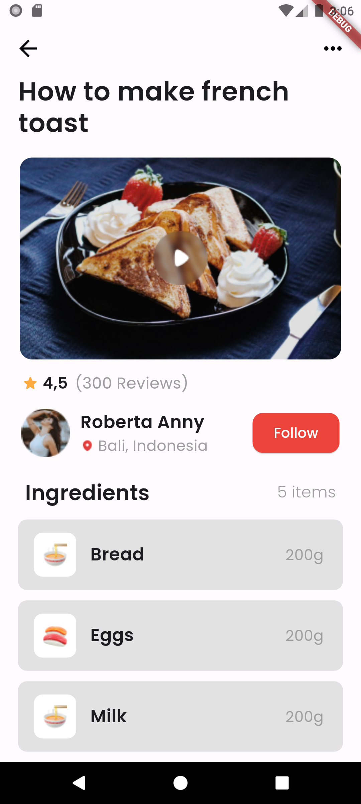

OVERVIEW: For the purpose of tidiness of codes, I constructed my main.dart page to return my homepage, the homepage, being a file in the folder 'pages'.

I had the homepage divided into a number of sections represented by widgets, namely:
- topButtonSection(), which represents the top buttons in the appbar of the homepage.

- headerSection(), which represents the write-up at the top of the homepage, reading 'How to make french toast'.

- playVideoSection(), which represents the section of the homepage that has a video of the food.

- profileSection(), which represents the part of the homepage that has the profile of the page to be followed.

- allFoodSection(), which represents the section of the homepage that has the write-up 'Ingredients', as well as the containers for Bread, Eggs, and Milk.

Each of these sections have widgets created for them in the 'widgets' folder in the 'lib' folder.
I wrapped all of these sections in the body of the homepage in a SingleChildScrollView() and spaced them with a SizedBox() for a beautiful scrolling experience.

ARCHITECTURE: Some of these sections listed above, represented by widgets have sub-widgets created also for them in the same 'widgets' folder. For example,
- the playVideoSection is comprised of two widgets, video() and playButton(), arranged in a stack for the purpose of an overlay.

- the profileSection is a column with reviewSection() as its first row and the scond row having the aboutSection() and followButton() separated by MainAxisAlignment.spaceBetween

- the allFoodSection is a expanded column with four rows; the first row being the header- 'Ingredients' with '5 items'. The other rows are the breadSectionContainer(), eggsSectionContainer() and milkSectionContainer(), all separated by a constant SizedBox().

These containers are widgets with sub-widgets as well. 
- The breadSectionContainer() is a container that houses the breadSection() and the text '200g'; the breadSection(), being a row containing a picture of the bread as well as the text 'Bread'.

- The eggsSectionContainer() is a container that houses the eggsSection() and the text '200g'; the eggsSection(), being a row containing a picture of the eggs as well as the text 'Eggs'.

- The milkSectionContainer() is a container that houses the milkSection() and the text '200g'; the milkSection(), being a row containing a picture of the milk as well as the text 'Milk'.

DEPENDENCIES:
- I imported the GoogleFonts.poppins fonts used in this project using:
import 'package:google_fonts/google_fonts.dart';

- The images used in this project are in the 'assets/images' folder.

- I declared the deviceWidth and deviceHeight using;
    deviceHeight = MediaQuery.of(context).size.height;
    deviceWidth = MediaQuery.of(context).size.width;
    
- I tested this project on a Google Pixel 6 phone and tweaked most configurations of width and height, as ratios of the deviceWidth or deviceHeight.